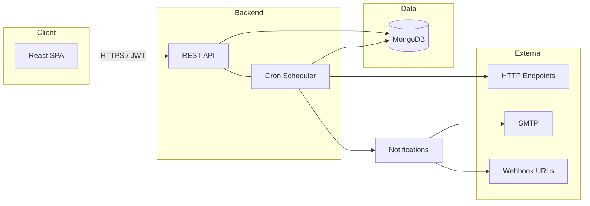
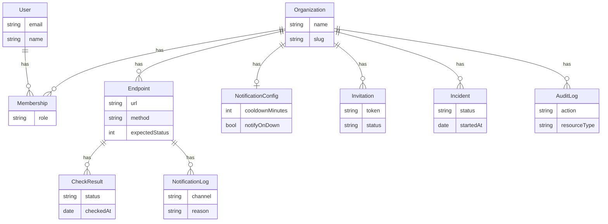
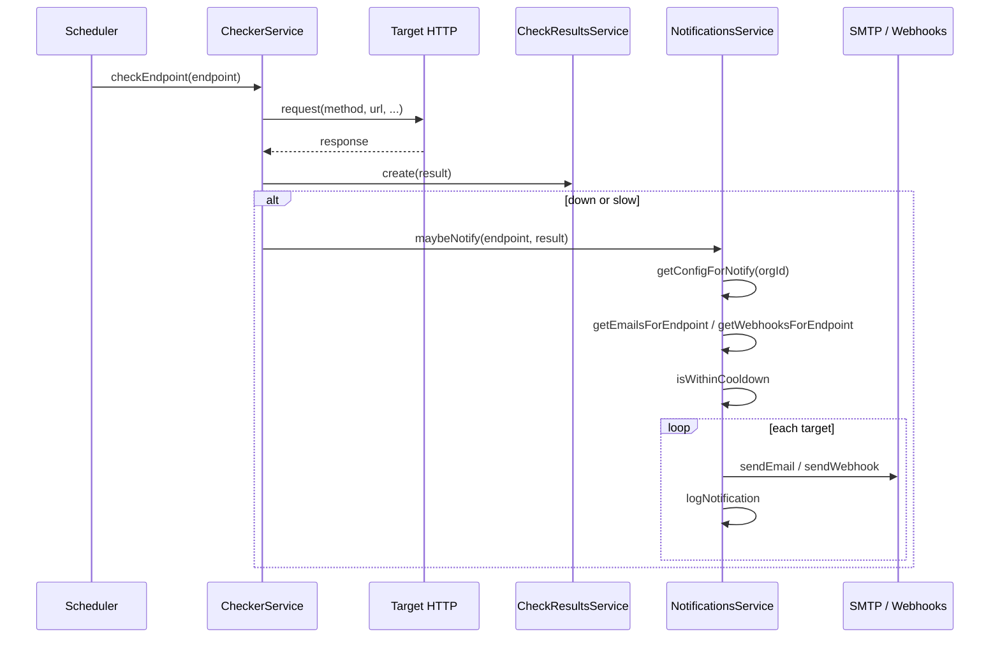

# API Status Notifier — Architecture and System Design

This document describes the full architecture, data model, and system design of the API Status Notifier service.

---

## 1. System overview and goals

**Purpose**

- Monitor HTTP endpoints on a configurable schedule.
- Alert via email and webhook when endpoints are **down** (wrong status or error) or **slow** (response time above threshold).
- Optional: public status page per organization, SLA breach alerts, and digest emails (daily/weekly summary).

**Multi-tenancy**

- All core resources are **organization-scoped**. Users belong to one or more organizations with a **role** per org: `admin`, `member`, or `viewer`.
- Endpoints, notification config, incidents, and audit log are stored per organization. Access is enforced by membership and role.

**Out of scope (current design)**

- No distributed workers or job queue; a single process runs both the REST API and the cron scheduler.
- No real-time push to the UI (e.g. WebSockets); the dashboard reflects data when the user loads or refreshes.

---

## 2. High-level architecture

**Components**

- **Browser**: React SPA (Vite in development, static build in production). In dev, `/api` is proxied to the backend.
- **Backend**: NestJS on Node.js — REST API plus in-process cron (scheduler every 2 minutes, digest at 09:00 daily).
- **Database**: MongoDB as the single source of truth.
- **Outbound**: Backend performs HTTP checks (axios) to monitored URLs; sends email (nodemailer/SMTP) and POSTs to webhook URLs when configured.

---

## 3. Technology stack

| Layer | Technologies |
|-------|--------------|
| **Backend** | NestJS, Mongoose (MongoDB), Passport JWT, `@nestjs/schedule`, axios, nodemailer. Configuration via `ConfigModule` (env). |
| **Frontend** | React 18, Vite, TypeScript, react-router-dom, Tailwind CSS. API client: `fetch` with JWT in `Authorization` header; token stored in `localStorage`. |
| **Database** | MongoDB. No Redis or message queue. |

---

## 4. Data model

All persistence is in MongoDB. Schemas live under `backend/src` (e.g. `**/schemas/*.schema.ts`).

### Entities

| Entity | Key fields | Notes |
|--------|------------|--------|
| **User** | `email` (unique), `password` (hashed, `select: false`), `name` | Referenced by Membership, Invitation, AuditLog. |
| **Organization** | `name`, `slug` (unique, sparse), `statusPageEnabled`, `statusPageTitle`, `timezone`, `createdBy` | Slug used for public status URL. |
| **Membership** | `userId`, `organizationId`, `role` (`admin` \| `member` \| `viewer`) | Unique on `(userId, organizationId)`. |
| **Endpoint** | `organizationId`, `name`, `url`, `method`, `expectedStatus`, `timeoutMs`, `slowThresholdMs`, `checkIntervalMinutes`, `maintenanceUntil`, `tags`, `slaTargetPercent`, `slaWindowDays`, `headers`, `authType` (none/basic/bearer), auth credentials | Checker uses these to perform HTTP requests. |
| **CheckResult** | `endpointId`, `status` (up/down/slow), `statusCode`, `responseTimeMs`, `errorMessage`, `checkedAt` | Index: `(endpointId, checkedAt desc)`. |
| **NotificationConfig** | `organizationId`, `emailTargets` (email + optional `endpointIds`), `webhooks` (url, label, optional `endpointIds`), `notifyOnDown`, `notifyOnSlow`, `cooldownMinutes`, `digestEnabled`, `digestFrequency`, `digestDayOfWeek` | Legacy: `email`, `webhookUrl`, `emails`. |
| **NotificationLog** | `endpointId`, `channel` (email/webhook), `reason` (down/slow/sla_breach), `target`, `sentAt` | Used for cooldown and “Recent notifications” UI. |
| **Invitation** | `organizationId`, `inviterId`, `inviteeEmail`, `token` (unique), `role`, `status` (pending/accepted/expired/cancelled), `expiresAt` | Accept creates a Membership. |
| **Incident** | `organizationId`, `title`, `description`, `status` (open/resolved), `startedAt`, `resolvedAt`, `resolvedBy`, `endpointIds`, `resolveNote` | Shown on public status page and in digest. |
| **AuditLog** | `organizationId`, `userId`, `action`, `resourceType`, `resourceId`, `metadata`, `createdAt` | Indexes: org + createdAt, org + action. |

### Relationships

- **User** 1:N **Membership** N:1 **Organization**
- **Organization** 1:N **Endpoint**, 1:1 **NotificationConfig**, 1:N **Invitation**, 1:N **Incident**, 1:N **AuditLog**
- **Endpoint** 1:N **CheckResult**, 1:N **NotificationLog**

### ER-style diagram

---

## 5. Backend architecture

### Module layout

`backend/src/app.module.ts` imports:

- **ConfigModule** (global)
- **MongooseModule** (async, URI from env)
- **AuthModule**, **OrganizationsModule**, **InvitationsModule**
- **EndpointsModule**, **CheckResultsModule**, **CheckerModule**, **NotificationsModule**, **SchedulerModule**, **StatusModule**
- **AuditLogModule**, **IncidentsModule**

### Request flow

1. Incoming HTTP request → CORS (enabled in `main.ts`).
2. If the route is protected: **JwtAuthGuard** validates `Authorization: Bearer <token>` and attaches `user` (id, email) to the request.
3. For org-scoped routes: **OrgMemberGuard** reads `orgId` from params, loads membership, attaches `membership` and `orgId`; rejects if not a member.
4. **RolesGuard** + **RequireRole** (where used) ensure `membership.role` allows the action (e.g. admin for org PATCH, member for endpoint create).
5. Controller → Service → Mongoose.

**Public routes** (no JWT or optional JWT):

- `POST /auth/register`, `POST /auth/login`
- `GET /invitations/:token` (OptionalJwtGuard — no 401 if missing)
- `POST /invitations/:token/accept` (JWT required)
- `GET /public/status/:orgSlug` (no auth)

### Auth details

- JWT payload: `sub` (userId), `email`. Issued on login and register.
- Token stored in frontend `localStorage`; sent as `Authorization: Bearer <token>`.
- **OrgMemberGuard** (`backend/src/auth/guards/org-member.guard.ts`): resolves membership for `params.orgId` and current user; used on all `/orgs/:orgId/*` routes.

### Cron jobs

Implemented in `backend/src/scheduler/scheduler.service.ts`:

| Schedule | Job | Description |
|----------|-----|-------------|
| `*/2 * * * *` (every 2 min) | `runScheduledChecks` | Load all endpoints; for each, skip if in maintenance; if `now >= lastChecked + checkIntervalMinutes`, call `CheckerService.checkEndpoint(endpoint)`. |
| `0 9 * * *` (daily 09:00) | `runDigests` | Load configs with `digestEnabled`; for each, if frequency matches (daily or weekly on `digestDayOfWeek`), call `NotificationsService.sendDigest`. |

### Checker pipeline

`backend/src/checker/checker.service.ts`:

1. Build axios request: endpoint `method`, `url`, `timeoutMs`, `headers`, basic or bearer auth if configured.
2. Execute request; measure response time.
3. Determine status: `down` if status !== expected or exception; `slow` if response time > `slowThresholdMs`; else `up`.
4. Persist **CheckResult** via `CheckResultsService.create`.
5. If `down` or `slow`: call `NotificationsService.maybeNotify(endpoint, result)` (respects notifyOnDown/notifyOnSlow, cooldown, and per-endpoint email/webhook scoping).
6. If endpoint has `slaTargetPercent`: compute uptime over `slaWindowDays`; if below target, call `maybeNotifySlaBreach`.
7. On exception: record a `down` result and still run notify + optional SLA breach.

### Notification scoping

- **getEmailsForEndpoint(config, endpointId)** and **getWebhooksForEndpoint(config, endpointId)** filter `emailTargets` / `webhooks` by `endpointIds` (empty or missing = “all endpoints”).
- Cooldown is per `(endpointId, reason)` using **NotificationLog** (last sent time vs `cooldownMinutes` from config).
- Each sent email/webhook is logged in **NotificationLog**.

---

## 6. Frontend architecture

### Routing

`frontend/src/App.tsx`:

- **Public**: `/` (Landing), `/login`, `/register`, `/invite/:token`, `/status/:orgSlug` (public status page).
- **Protected** (under `ProtectedRoute`): `/orgs` with `OrgProvider`.
  - `/orgs` → Org list (choose org).
  - `/orgs/:orgId` → OrgLayout with tabs: Dashboard (index), status, endpoints/:endpointId/history, notifications, incidents, settings.
- Catch-all `*` → redirect to `/`.

### State

- **AuthContext**: token and user (from JWT payload); token persisted in `localStorage`; `isReady` after initial read.
- **OrgContext**: current `orgId` (from URL) and `role` (from org list / membership). No global data store; each page fetches via `api.*` and uses local `useState` / `useEffect`.

### API client

`frontend/src/api/client.ts`:

- `BASE = import.meta.env.VITE_API_URL || '/api'` (dev proxy strips `/api` and forwards to backend).
- `getToken()` / `setToken()` use `localStorage['access_token']`.
- `request(path, options)` adds `Content-Type: application/json` and `Authorization: Bearer <token>`; on 401 clears token and redirects to `/login`.
- Typed methods for: auth (login, register), orgs, members, invitations, endpoints, status (list, history, uptime), notifications (config, log), incidents, audit-log.

### Key pages

- **Landing**: Marketing copy, “Get started” / “Log in” links; if user is logged in, redirect to `/orgs`.
- **Dashboard**: Endpoints list, “Add endpoint” form (name, URL, method, expected status, timeout, slow threshold, interval, headers, auth, tags, SLA), status badges, maintenance presets, tag filter.
- **Notifications**: Email targets and webhooks with per-endpoint scope (All endpoints vs selected), notify on down/slow, cooldown, digest settings; Save.
- **Settings**: Org name, status page title, timezone; members list and role changes; create/cancel invitations; danger zone (delete org).

---

## 7. Core flows

### Endpoint check and notify

### Invitation flow

1. Admin: POST `orgs/:orgId/invitations` (email, role) → create Invitation with token, status pending.
2. Invitee opens `/invite/:token` → GET `invitations/:token` (optional JWT) → UI shows invite details and “Register” or “Accept” depending on auth.
3. If not logged in: register or login (optional `inviteToken` in register body to auto-join after signup).
4. POST `invitations/:token/accept` (JWT) → create Membership, set invitation status to accepted; return `orgId`.

### Public status page

1. Client: GET `public/status/:orgSlug` (no auth).
2. Backend: resolve organization by slug (for public status); load endpoints, latest check per endpoint (e.g. `getLatestForAllEndpoints`), 24h uptime per endpoint, recent incidents.
3. Response: `orgName`, `slug`, `overallStatus` (operational | partial_outage | major_outage), `services` (per-endpoint status, uptime24h, maintenanceUntil), `incidents`.

---

## 8. API design summary

| Area | Method | Path | Auth / Guards | Description |
|------|--------|------|----------------|-------------|
| Auth | POST | /auth/register | none | email, password, name?, inviteToken? → access_token, user |
| Auth | POST | /auth/login | none | email, password → access_token, user |
| Orgs | GET | /orgs | JWT | List orgs with role |
| Orgs | POST | /orgs | JWT | Create org (user becomes admin) |
| Orgs | GET | /orgs/:orgId | JWT, OrgMember | Get org |
| Orgs | PATCH | /orgs/:orgId | JWT, OrgMember, RequireRole(admin) | Update org |
| Members | GET/PATCH | /orgs/:orgId/members | JWT, OrgMember, RequireRole(admin) | List / update role or remove |
| Invitations | GET | /invitations/:token | OptionalJWT | Invite details (valid, orgName, role, …) |
| Invitations | POST | /invitations/:token/accept | JWT | Accept invite → membership |
| Invitations | GET/POST | /orgs/:orgId/invitations | JWT, OrgMember, RequireRole(admin) | List pending / create |
| Invitations | POST | /orgs/:orgId/invitations/:id/cancel | JWT, OrgMember, RequireRole(admin) | Cancel pending |
| Endpoints | GET/POST | /orgs/:orgId/endpoints | JWT, OrgMember, RequireRole(member) | List / create |
| Endpoints | GET/PATCH/DELETE | /orgs/:orgId/endpoints/:id | JWT, OrgMember, RequireRole(member) | Get / update / delete |
| Status | GET | /orgs/:orgId/status | JWT, OrgMember, RequireRole(viewer) | Status + latest check |
| Status | GET | /orgs/:orgId/status/uptime/:endpointId | JWT, OrgMember, RequireRole(viewer) | Uptime % |
| Status | GET | /orgs/:orgId/status/history/:endpointId | JWT, OrgMember, RequireRole(viewer) | Check history |
| Status | GET | /public/status/:orgSlug | none | Public status JSON |
| Notifications | GET/PATCH | /orgs/:orgId/notifications/config | JWT, OrgMember, RequireRole(member) | Get / update config |
| Notifications | GET | /orgs/:orgId/notifications/log | JWT, OrgMember, RequireRole(viewer) | Recent log |
| Incidents | GET/POST | /orgs/:orgId/incidents | JWT, OrgMember, RequireRole(member) | List / create |
| Incidents | GET/PATCH | /orgs/:orgId/incidents/:id, resolve | JWT, OrgMember, RequireRole(member) | Get / resolve |
| Audit | GET | /orgs/:orgId/audit-log | JWT, OrgMember, RequireRole(viewer) | List with filters |

---

## 9. Security considerations

- **Secrets**: JWT_SECRET, SMTP credentials, MONGODB_URI in environment only; not in repo. Passwords hashed with bcrypt (10 rounds). Endpoint basic/bearer credentials stored in DB; API masks `authPassword` and `authBearerToken` in responses (e.g. placeholder).
- **Auth**: Org-scoped routes require valid JWT and membership; role enforced for mutations. Public endpoints: `/public/status/:orgSlug`, auth and invite routes as above.
- **CORS**: `app.enableCors()` in `main.ts`; restrict origin in production if needed.
- **Input**: DTOs with class-validator where applied (e.g. CreateEndpointDto, RegisterDto). Org and resource IDs from params validated by guards and services (e.g. OrgMemberGuard, NotFoundException).

---

## 10. Deployment and configuration

**Backend environment** (see `backend/.env.example`):

- `MONGODB_URI` or `DATABASE_URL`, `PORT`, `JWT_SECRET`, `JWT_EXPIRES_IN`
- `SMTP_HOST`, `SMTP_PORT`, `SMTP_USER`, `SMTP_PASS` (optional)
- `ENABLE_EMAIL_NOTIFICATIONS`, `ENABLE_WEBHOOK_NOTIFICATIONS`, `NOTIFICATION_COOLDOWN_MINUTES`
- `FRONTEND_URL` (for invite links in emails)

**Frontend**: `VITE_API_URL` — in production set to the backend base URL (e.g. `https://api.example.com`). In dev, default `/api` is proxied by Vite to the backend.

**Run**:

- Backend: `npm run start:dev` or build + `start:prod`.
- Frontend: `npm run dev` (dev) or `npm run build` and serve `dist` statically.
- MongoDB: single instance; indexes are defined on the Mongoose schemas.

---

## 11. Limitations and future work

**Limitations**

- Single process: API and cron share one Node process; no horizontal scaling of the scheduler without duplicate runs.
- No API rate limiting.
- No retry queue for failed email/webhook deliveries.

**Future considerations**

- Queue-based checks (e.g. Bull + Redis) for scaling and retries.
- Rate limiting on auth and API routes.
- API keys for programmatic access.
- More digest options (e.g. time window, timezone-aware send time).
